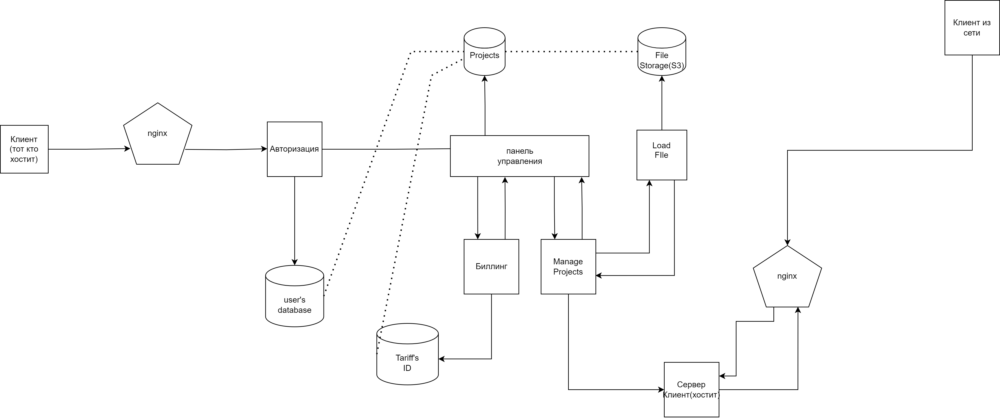

# Панельный Хостинг

## Описание

Проект представляет собой хостинг с панелью управления, построенный на основе микросервисной архитектуры(**gRPC** и **REST**). Для внешних клиентов используется **API Gateway**, а **Nginx** служит в качестве обратного прокси-сервера, маршрутизируя запросы и перенаправляя трафик с портов микросервисов и пользоватлеьских контейнеров.

Данные пользователей хранятся в **PostgreSQL**(своя бд для каждого сервиса), а проекты загружаются в **S3-хранилище**, которое реализовано в **storage-microservice** Для эфеективности и ускорения доступа к данным используется **Redis** в **project-microservice**. Для обеспечения безопасности взаимодействий с системой применяются **JWT-токены**.

## Структура проекта

1. **Authentication**  
   Микросервис, отвечающий за регистрацию вход и авторизацию пользователей. Для защиты данных и безопасного доступа используются **JWT-токены**. Взаимодействие между сервисами реализовано через gRPC.

2. **Billing**  
   Модуль для управления тарифами, выставления счетов и обработки платежей. На данный момент находится в стадии разработки.

3. **Project**  
   Микросервис для управления проектами пользователей. Использует **Redis** для кэширования данных, что ускоряет операции и снижает нагрузку на базу данных.

4. **Storage**  
   Микросервис для работы с файлами пользователей. Хранение данных реализовано через **S3-хранилище**, обеспечивающее безопасность, масштабируемость и доступность файлов.

5. **Control Panel**  
   Центральный интерфейс, через который пользователи взаимодействуют с системой. Панель управляет созданием проектов, загрузкой файлов и запуском хостинг-проектов. Взаимодействие между пользователем и микросервисами проходит через **API Gateway** и **Nginx** (в разработке).

## Технологии

- **Go** — основной язык программирования для разработки микросервисов.
- **gRPC** — для внутреннего взаимодействия между микросервисами.
- **API Gateway** — обрабатывает внешние запросы и маршрутизирует их к соответствующим сервисам.
- **JWT-токены** — для обеспечения безопасной аутентификации и авторизации.
- **Nginx** — выполняет роль обратного прокси-сервера и маршрутизирует запросы.
- **Docker** — для контейнеризации микросервисов, а также проектов пользователя.
- **PostgreSQL** — основная база данных для хранения информации о пользователях, проектах и платежах. Используется за счет ее надежности, простого использования, и масштабируемости.
- **Redis** — применяется в project-microservice для кэширования данных.
- **S3-хранилище** — используется для масштабируемого хранения файлов в рамках storage-microservice.
- **Frontend** - используется для отображения интерфейса взаимодействия между клиентом и сервисами


Все взаимодействия пользователей с системой происходят через панель управления. Это центральный интерфейс, где пользователи могут:
- Регистрироваться и входить в аккаунт, получая доступ к панели.
- Создавать проекты.
- Загружать файлы.
- Запускать свои хостинг-проекты.

## Диаграмма взаимодействий



1. Пользователь регистрируется и входит в аккаунт через JWT.
2. Создает проект через панель управления.
3. Загружает файлы, которые сохраняются в S3-хранилище через storage-microservice.
4. Запускает проект, взаимодействуя с project-microservice.
5. Проект становится доступным через локальный адрес, а также при запуске на специальном хосте по доменному имени **projectname**.ghst.tech. , где пользователь может выбрать имя поддомена.
____
## Отказоустойчивость
В проекте реализованы ключевые паттерны для обеспечения надежности и отказоустойчивости:
Graceful Shutdown
Все микросервисы поддерживают корректное завершение работы (graceful shutdown). Это позволяет завершать активные запросы перед остановкой, корректно закрывать соединения с базами данных и внешними сервисами, а также освобождать ресурсы.

Retry с экспоненциальной задержкой
В случае ошибок в критическом месте (например, при создании проекта или временной недоступности сервисов) реализован механизм повторных попыток (retry) с экспоненциальной задержкой: 1, 2, 4, 8 секунд. Это позволяет справляться с временными сбоями, не перегружая систему повторными запросами.

___
## Пример
По [ссылке на диске](https://drive.google.com/drive/folders/1nbpg4vkCdptJ9-QnaBt3KZFtU0oPVbg1) можно увидеть видео пример использования сервиса при локальном запуске и хостинге с использованием Nginx для перенаправления запросов из сети по адресу http://hello.ghst.tech:8080/ (⚠️ работает только когда включена сервер-машина). Для теста
 на вашем компьютере можно проследовать шагам на видео с использованием архива на диске и открыть ссылку http://localhost:8090/ на которой и находится размещенный сервер из архива. Аналогично можно испрользовать любой другой архив с настроенным контейнером, в котором проброшены порты(на данный момент порты не должны пересекатсья с уже существующими)
___
## Установка

### Требования

1. Установите [Docker](https://docs.docker.com/get-docker/).
2. Убедитесь, что у вас установлен Go (v1.20+)

### Клонирование репозитория

```bash
git clone https://github.com/fluffy11lol/PanelHosting
cd PanelHosting
```

## Сборка
Соберите проект и разверните его:
```bash
docker-compose up --build
```
⚠️ Первый запуск может занять время(если нечего не работает, то повторите эту команду). Если возникли проблемы, повторите команду.

## Запуск storage-microservice
Storage-microservice необходимо запускать вручную через main.go, так как через Docker он пока не работает
```bash
cd .\src\services\storage-microservice\
go run .\cmd\main\main.go
```
## Использование
1. Перейдите на localhost:8082/dashboard.
2. Зарегистрируйтесь или войдите в систему (используется JWT для авторизации).
3. Создайте проект и загрузите zip-архив, содержащий ваш код (включая Dockerfile и docker-compose.yaml).
4. Нажмите "Старт"(на фронте нечего не произойдет, но там где вы запустили storage-microservice вы увидите логи как запустился ваш докер контейнер).
5. Перейдите на localhost:(порт из вашего проекта в примере 8090) для проверки работы.
6. Если возникли ошибки, вернитесь к шагу 3 и проверьте правильность структуры проекта.

